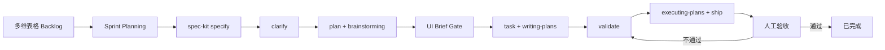

# ecom-ai-system 研发 SOP

> 本文档由 `/dev-sop-flow init` 自动生成于 2026-06-14。
> 多维表格：https://j13juzq4tyn.feishu.cn/base/JMGObsLqvamoCAsxGgHcxzqtn5u

## 流程总览



## 角色定义

- **PO**：负责录入需求、定义优先级、最终验收
- **Dev**：执行 spec-kit + superpowers 完整流程
- **轮值 SM**：每个 Sprint 5 分钟检查仪表盘，确保流程不卡

## 精简 Scrum 仪式

| 仪式 | 频率 | 时长 | 怎么做 |
|------|------|------|--------|
| Sprint Planning | 每 Sprint 开始 | 30 分钟 | Backlog 视图 → 选需求 → `/dev-sop-flow new-sprint` |
| 每日同步 | 每天 | 10 分钟 | Sprint 看板 → 三件套（昨天/今天/阻塞） |
| Sprint Review | 每 Sprint 结束 | 30 分钟 | 仪表盘 → 完成率 → 演示 → `/dev-sop-flow end-sprint` |
| 回顾 | 每 2-3 个 Sprint | 15 分钟 | 三问：继续/停止/开始 |

## 日常操作速查

### 录入需求
直接在多维表格「需求管理」表新增一行，状态默认 Backlog。

### 开始 Sprint
```
/dev-sop-flow new-sprint
```
按提示选需求、定目标、确认 DoD、激活 gstack 技能。

### 执行需求
1. 在多维表格选中一个「已规划」需求，记下 `REQ-ID`
2. 直接运行 `specify` 开始
3. 阶段完成后运行：`/dev-sop-flow sync REQ-{{ID}}` 回写状态（Phase 1 手动）
4. 如果 `是否UI相关=是`，在 Plan 审阅后、Task 前运行 `$prd-uidemo-ui-brief`，生成并确认 `ui-implementation-brief.md`
5. 回写 `UI Brief状态=已确认` 和 `UI Brief链接` 后，再进入 writing-plans / Task

### UI Brief Gate

UI 相关需求禁止直接从 PRD 进入实现。必须先基于 PRD、`docs/ui-design-contract.md` 和 UIDEMO 证据源（本地原型代码、Figma Design，或混合来源）生成 UI Implementation Brief，并在多维表格记录：

- `是否UI相关`
- `UI平台`
- `UI来源类型`
- `UIDEMO路径`
- `Figma链接`
- `Figma节点`
- `UI证据摘要链接`
- `UI Design Contract路径`
- `UI Brief链接`
- `UI Brief状态`
- `UI风险等级`
- `UI验收状态`

`/dev-sop-flow sync` 会在 UI 相关 REQ/FUNC 进入 Task 或之后状态前检查 `UI Brief状态=已确认` 且 `UI Brief链接` 非空。Sprint 收尾前，UI 相关 REQ/FUNC 必须 `UI验收状态=通过`。

### 查看进度
- Sprint 看板：每日同步用
- Sprint 仪表盘：Review 用
- AI 审计日志：质量追溯用

## 状态机速查

完整状态机见 `packages/pm-tools/skills/dev-sop-flow/references/status-machine.md`。

## 自动化演进路线图

- **第一阶段（当前）**：手动 `/dev-sop-flow sync` 在关键节点触发
- **第二阶段**：Claude Code hooks 自动监听 spec-kit / superpowers 工具调用
- **第三阶段**：CI 集成、PR 自动回写、验收自动推进

## 不在范围

- 多团队跨 Sprint 协调
- 特定技术栈开发规范
- 多维表格 webhook 联动（第二阶段扩展点）
